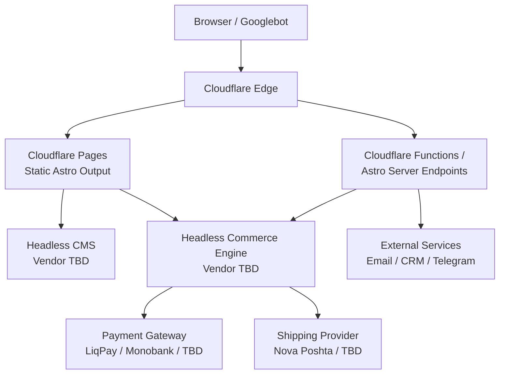

# Med.uz.ua 2.0 — System Architecture

## 1. Overview & Goals

Med.uz.ua 2.0 is a full rebuild of the existing `med.uz.ua` platform.

The current system is a legacy WordPress stack based on:

- WordPress
- BeTheme
- WPBakery
- WooCommerce
- custom PHP
- custom JavaScript
- multiple WordPress plugins
- server-rendered PHP pages
- shared CMS, commerce, frontend, and runtime concerns inside one monolith

The target architecture is a modern, composable, static-first web platform designed around clear domain boundaries.

The primary architectural goals are:

1. **Maximum frontend performance**
   - minimize JavaScript delivered to the browser;
   - generate static HTML wherever possible;
   - optimize for Core Web Vitals;
   - serve assets from Cloudflare's edge network.

2. **Strong SEO**
   - server-rendered/static HTML for all indexable content;
   - predictable URLs;
   - structured metadata;
   - canonical URL control;
   - no client-side rendering dependency for core content.

3. **Simple operational model**
   - no traditional always-on application server;
   - no PHP runtime;
   - no manually managed VPS;
   - minimal infrastructure to maintain.

4. **Clear separation of business domains**
   - marketing content belongs to the CMS;
   - commerce belongs to the commerce engine;
   - presentation belongs to Astro;
   - frontend code must not become the source of truth for business data.

5. **Excellent developer experience**
   - TypeScript strict mode;
   - schema validation;
   - component-based frontend;
   - Git-based deployment;
   - automated CI/CD.

6. **Pragmatic extensibility**
   - the architecture must allow future growth;
   - version 1.0 must not introduce infrastructure that is not yet required.

---

## 2. Architectural Principles

### 2.1 Static First

Every route that can be generated as static HTML should be generated as static HTML.

Examples:

```text
/
/kids/
/services/
/services/diagnostics/
/services/contact-lenses/
/doctors/
/doctors/myroslava-leno/
/prices/
/contacts/
```

Static generation is the default.

Server-side execution is introduced only for functionality that genuinely requires it, such as:

- form submission;
- commerce operations;
- checkout integration;
- secure API access;
- server-side secrets.

---

### 2.2 Zero JavaScript by Default

JavaScript is not considered part of the baseline rendering architecture.

A normal marketing page should work as:

```text
HTML
+
CSS
+
browser-native functionality
```

Interactive JavaScript is added only when state or behavior cannot reasonably be implemented without it.

Examples where an island may be justified:

- cart drawer;
- advanced product filtering;
- interactive booking widget;
- dynamic stock indicator;
- complex product configurator.

The presence of one interactive component must not turn the entire application into a client-rendered SPA.

---

### 2.3 YAGNI

Version 1.0 intentionally excludes infrastructure that is not currently justified by product requirements.

Not included in v1.0:

- microservices;
- Kubernetes;
- message brokers;
- Cloudflare Queues;
- Cloudflare D1;
- Cloudflare R2 as application storage;
- a monorepo;
- distributed tracing infrastructure;
- custom commerce backend;
- custom CMS;
- long-running Node.js application servers.

The system should become more complex only when observable product requirements justify that complexity.

---

### 2.4 Single Source of Truth

Every business entity must have one authoritative owner.

Examples:

| Data | Source of Truth |
|---|---|
| Service description | CMS |
| Doctor biography | CMS |
| Medical service price | CMS |
| FAQ content | CMS |
| SEO metadata | CMS |
| Physical product | Commerce Engine |
| Product price | Commerce Engine |
| Product stock | Commerce Engine |
| Cart | Commerce Engine |
| Order | Commerce Engine |
| Payment status | Commerce Engine |

Data should not be duplicated manually between systems unless a documented synchronization mechanism exists.

---

## 3. High-Level System Architecture



Conceptually, the frontend acts as an aggregator.

The browser does not need direct knowledge of the infrastructure behind the system.

For most routes:

```text
Browser
   ↓
Cloudflare Edge
   ↓
Pre-generated Astro HTML
```

For secure or dynamic actions:

```text
Browser
   ↓
Cloudflare Edge
   ↓
Astro Endpoint / Cloudflare Function
   ↓
External API / Commerce Engine
```

---

## 4. Core Technologies

## 4.1 Astro

Astro is the primary frontend framework.

### Responsibilities

Astro owns:

- routing;
- page composition;
- layouts;
- rendering;
- static generation;
- server endpoints;
- component orchestration;
- integration with CMS and commerce APIs.

### Why Astro

The Med.uz.ua workload is predominantly content-oriented.

Approximately 90% of pages are expected to consist of:

- service pages;
- medical information;
- doctor profiles;
- prices;
- FAQs;
- contact information;
- SEO landing pages.

These pages do not require a persistent JavaScript application runtime.

Astro therefore fits the workload better than a SPA-first framework.

The architectural default is:

```text
Astro Component
      ↓
Build
      ↓
Static HTML
      ↓
Browser
```

JavaScript hydration is opt-in rather than automatic.

---

## 4.2 Why Not Next.js

Next.js is not rejected because it is technically incapable of implementing the system.

It is rejected because its additional runtime and conceptual complexity are not justified by the current requirements.

The project does not primarily need:

- complex authenticated dashboards;
- rich client-side application state;
- React Server Component boundaries;
- pervasive React hydration;
- application-style navigation;
- a full React runtime across most pages.

Using Next.js would introduce additional framework concepts without providing proportional value for a predominantly static medical and commerce website.

If Med.uz.ua later develops into a highly interactive authenticated platform, this decision may be revisited.

---

## 4.3 TypeScript

All application code should use TypeScript.

Configuration:

```json
{
  "compilerOptions": {
    "strict": true
  }
}
```

TypeScript is used for:

- components;
- API contracts;
- CMS adapters;
- commerce adapters;
- server endpoints;
- form schemas;
- shared business types.

The objective is to prevent unvalidated external data from propagating through the application.

---

## 4.4 Tailwind CSS

Tailwind is used as the primary styling system.

However, Tailwind utility classes must be built on top of a coherent design system.

The project must avoid arbitrary values scattered throughout components.

Prefer semantic design tokens for:

```text
colors
spacing
typography
radius
shadows
breakpoints
surface hierarchy
```

Conceptual example:

```text
primary
primary-hover
surface
surface-muted
text
text-muted
border
danger
success
```

The visual identity should remain centralized even if the implementation uses utility classes.

---

## 4.5 Zod

Zod is the schema-validation boundary for untrusted data.

It should be used for:

- form submissions;
- CMS responses where appropriate;
- server endpoint payloads;
- environment validation;
- commerce integration data;
- webhook validation where applicable.

Example:

```ts
import { z } from "zod";

export const appointmentSchema = z.object({
  name: z.string().trim().min(2).max(80),
  phone: z.string().trim().min(10).max(20),
});
```

Types should be inferred from schemas when possible:

```ts
export type AppointmentInput =
  z.infer<typeof appointmentSchema>;
```

---

## 4.6 Cloudflare Pages

Cloudflare Pages hosts the static frontend.

Primary responsibilities:

- serving generated HTML;
- serving static assets;
- CDN delivery;
- TLS termination;
- edge caching;
- preview deployments.

The public marketing site should primarily consist of immutable deployment artifacts.

---

## 4.7 Cloudflare Functions / Astro Server Endpoints

Lightweight server-side behavior runs at the edge.

Typical use cases:

```text
POST /api/appointments
POST /api/contact
commerce server operations
secure API proxying
webhook handling
```

Functions must remain small and stateless.

Persistent domain logic belongs in the external system that owns that domain.

---

## 4.8 Why No Traditional Node.js Backend

A continuously running Node.js server is deliberately excluded.

The current application does not require:

- persistent application processes;
- WebSocket servers;
- long-running jobs;
- server-managed sessions;
- in-memory application state;
- internal service orchestration.

Introducing a traditional Node.js backend would create additional operational responsibility:

```text
server provisioning
runtime patching
process management
autoscaling
logging
health checks
deployment coordination
```

without solving a current product problem.

Edge/serverless functions are sufficient for v1.0.

---

# 5. Bounded Contexts

The system is separated into distinct business domains.

## 5.1 Clinic Content & Marketing

Owned by the Headless CMS.

Vendor:

```text
TBD
```

The CMS manages editorial content such as:

```text
LandingPage
Service
Doctor
MedicalPrice
FAQ
Equipment
ClinicLocation
SEO metadata
EducationalContent
```

Example service model:

```ts
interface Service {
  slug: string;
  title: string;
  description: string;
  hero: Image;
  sections: ContentSection[];
  doctor?: DoctorReference;
  price?: number;
  seo: SEO;
}
```

The CMS must not become the product inventory system.

---

## 5.2 Commerce & Optical Store

Owned by the Headless Commerce Engine.

Vendor:

```text
TBD
```

The final vendor selection depends on due diligence involving:

- Ukrainian payment providers;
- LiqPay;
- Monobank;
- potentially WayForPay;
- Nova Poshta;
- tax/fiscal requirements if applicable;
- inventory management;
- product variants;
- order management;
- operational UX.

The commerce domain owns:

```text
Product
ProductVariant
Inventory
Cart
Order
Payment
Shipping
Discount
Refund
```

The CMS must never be the source of truth for product inventory.

---

## 5.3 Frontend Aggregation Layer

Astro consumes both domains.

Example:

```text
CMS
 ↓
Service page content
 ↓
Astro
 ↑
Product recommendations
 ↑
Commerce
```

The frontend may combine data from multiple domains for presentation, but it must not assume ownership of that data.

---

# 6. Data Access Layer

External services must not be called directly from arbitrary Astro components.

Use adapters.

Example structure:

```text
src/lib/cms/
src/lib/commerce/
```

CMS API usage should look conceptually like:

```ts
const service =
  await cms.getServiceBySlug("pediatric-ophthalmology");
```

not:

```ts
fetch("https://vendor.example/api/query?...");

```

inside page components.

Likewise, commerce code should use:

```ts
const product =
  await commerce.getProductBySlug(slug);
```

The adapter boundary prevents vendor-specific API logic from spreading across the application.

---

# 7. Form Processing & Lead Pipeline

## 7.1 Appointment Submission

Appointment forms use a zero-PHP serverless flow.

```text
Static Astro Form
        ↓
POST /api/appointments
        ↓
Cloudflare Function / Astro Endpoint
        ↓
Zod Validation
        ↓
External Lead Destination
        ↓
Successful API Response
        ↓
200 OK
        ↓
Success UI
```

The browser must never decide independently that a submission succeeded.

Success is displayed only after a successful server response.

---

## 7.2 Example Request

```json
{
  "name": "Іван",
  "phone": "+380501234567",
  "service": "pediatric-ophthalmology"
}
```

---

## 7.3 Validation

Validation occurs server-side.

Conceptual endpoint:

```ts
export async function POST({
  request,
}: {
  request: Request;
}) {
  const body = await request.json();

  const result =
    appointmentSchema.safeParse(body);

  if (!result.success) {
    return Response.json(
      {
        ok: false,
        error: "INVALID_INPUT"
      },
      {
        status: 400
      }
    );
  }

  // Deliver lead to configured destination.

  return Response.json({
    ok: true
  });
}
```

Client-side validation may be added for UX, but it is never treated as a security boundary.

---

## 7.4 Lead Destination

Version 1.0 deliberately keeps lead delivery synchronous.

Possible destination:

```text
CRM API
Telegram API
Transactional email API
internal clinic endpoint
```

The exact service is implementation-dependent.

Flow:

```text
Function
  ↓
external API
  ↓
success
  ↓
200
```

If the downstream service fails:

```text
Function
  ↓
external API failure
  ↓
5xx / controlled error
  ↓
No fake success UI
```

---

## 7.5 Security Requirements

Appointment endpoints must implement:

- schema validation;
- request size limits;
- rate limiting where available;
- bot protection;
- server-side secrets;
- safe error responses;
- no sensitive information in logs;
- origin validation where appropriate.

Never expose:

```text
API secrets
private CMS credentials
commerce admin tokens
email provider credentials
payment secrets
```

to browser bundles.

---

# 8. Rendering Strategy

Routes should be explicitly classified.

## Static

Default for:

```text
homepage
service pages
doctor pages
FAQ pages
contact page
pricing pages
SEO landing pages
educational content
```

## Interactive Islands

Use selectively for:

```text
cart drawer
advanced product search/filter UI
product configurator
complex booking UX
```

## Server Endpoints

Use for:

```text
appointments
contact forms
commerce mutations
secure integrations
webhooks
```

The existence of dynamic functionality does not justify converting surrounding pages to full SSR.

---

# 9. Project Structure

Recommended v1.0 repository:

```text
med-uz-ua/
│
├── public/
│   ├── favicon.svg
│   ├── robots.txt
│   └── static/
│
├── src/
│   │
│   ├── components/
│   │   ├── ui/
│   │   │   ├── Button.astro
│   │   │   ├── Card.astro
│   │   │   ├── Container.astro
│   │   │   └── Section.astro
│   │   │
│   │   ├── clinic/
│   │   │   ├── AppointmentForm.astro
│   │   │   ├── DoctorCard.astro
│   │   │   ├── ServiceCard.astro
│   │   │   └── PriceList.astro
│   │   │
│   │   ├── commerce/
│   │   │   ├── ProductCard.astro
│   │   │   ├── ProductGrid.astro
│   │   │   └── CartDrawer.tsx
│   │   │
│   │   └── seo/
│   │       ├── SEO.astro
│   │       └── StructuredData.astro
│   │
│   ├── layouts/
│   │   ├── BaseLayout.astro
│   │   ├── MarketingLayout.astro
│   │   └── CommerceLayout.astro
│   │
│   ├── pages/
│   │   ├── index.astro
│   │   │
│   │   ├── kids/
│   │   │   └── index.astro
│   │   │
│   │   ├── services/
│   │   │   └── [slug].astro
│   │   │
│   │   ├── doctors/
│   │   │   └── [slug].astro
│   │   │
│   │   ├── shop/
│   │   │   ├── index.astro
│   │   │   └── [slug].astro
│   │   │
│   │   └── api/
│   │       └── appointments.ts
│   │
│   ├── lib/
│   │   ├── cms/
│   │   │   ├── client.ts
│   │   │   ├── queries.ts
│   │   │   ├── types.ts
│   │   │   └── index.ts
│   │   │
│   │   ├── commerce/
│   │   │   ├── client.ts
│   │   │   ├── products.ts
│   │   │   ├── cart.ts
│   │   │   ├── types.ts
│   │   │   └── index.ts
│   │   │
│   │   ├── analytics/
│   │   │   └── index.ts
│   │   │
│   │   └── env.ts
│   │
│   ├── schemas/
│   │   ├── appointment.ts
│   │   ├── cms.ts
│   │   └── commerce.ts
│   │
│   ├── styles/
│   │   └── global.css
│   │
│   └── types/
│       └── global.d.ts
│
├── tests/
│
├── .github/
│   └── workflows/
│       └── ci.yml
│
├── astro.config.mjs
├── tailwind.config.ts
├── tsconfig.json
├── package.json
├── pnpm-lock.yaml
├── .env.example
├── README.md
└── ARCHITECTURE.md
```

---

# 10. Component Design Rules

Components should be small and domain-oriented.

Avoid:

```text
MegaPageComponent
GenericEverythingComponent
```

Prefer:

```text
Hero
ServiceCard
DoctorCard
AppointmentForm
ProductCard
PriceList
FAQ
```

A component should not directly know about unrelated infrastructure.

For example:

```text
ProductCard
```

may receive:

```ts
{
  title,
  price,
  image,
  url
}
```

but should not instantiate a commerce API client internally.

Data fetching belongs higher in the tree.

---

# 11. SEO Architecture

SEO is a first-class system concern.

Every indexable page should support:

```text
title
meta description
canonical URL
Open Graph metadata
structured data
robots directives
breadcrumbs
```

CMS-managed pages should expose SEO fields through a typed model.

Example:

```ts
interface SEO {
  title: string;
  description: string;
  canonical?: string;
  noindex?: boolean;
}
```

The frontend translates that model into HTML metadata.

---

## 11.1 Existing URL Preservation

Migration must not unnecessarily change indexed URLs.

Existing high-value routes should either:

1. remain identical; or
2. receive explicit permanent redirects.

Example:

```text
OLD
/treatments/

NEW
/services/
```

must result in:

```http
301 Moved Permanently
Location: /services/
```

A migration redirect map must be created before production cutover.

---

# 12. Analytics

Analytics should be abstracted from individual components.

Avoid direct vendor calls throughout the UI:

```ts
gtag(...);
```

Prefer an internal API:

```ts
analytics.track("appointment_submitted", {
  service: "pediatric-ophthalmology"
});
```

The implementation may forward events to:

```text
GTM
GA4
Google Ads
```

This prevents Google-specific code from becoming coupled to component logic.

---

# 13. Environment Configuration

Environment-specific values must be supplied through environment variables.

Examples:

```text
CMS_API_URL
CMS_API_TOKEN

COMMERCE_API_URL
COMMERCE_PUBLIC_TOKEN

LEAD_API_URL
LEAD_API_TOKEN
```

Public and private variables must be clearly separated.

Secrets must never be committed to Git.

Provide:

```text
.env.example
```

with variable names but no credentials.

---

# 14. CI/CD

GitHub Actions is responsible for enforcing build quality before deployment.

## Pull Request Pipeline

```text
Pull Request
    ↓
Install dependencies
    ↓
Lint
    ↓
Typecheck
    ↓
Tests
    ↓
Astro build
    ↓
Success / Failure
```

Example commands:

```bash
pnpm install --frozen-lockfile
pnpm lint
pnpm typecheck
pnpm test
pnpm build
```

A failed check prevents merging.

---

## Production Pipeline

```text
Merge to main
      ↓
GitHub Actions
      ↓
Lint
      ↓
Typecheck
      ↓
Tests
      ↓
Build
      ↓
Deploy to Cloudflare
      ↓
Production
```

Production deployment should be deterministic.

The Git repository is the authoritative source of frontend deployments.

---

# 15. Deployment Environments

Minimum environments:

```text
local
preview
production
```

## Local

Used for development.

## Preview

Every pull request should be deployable to an isolated preview URL.

Used for:

- responsive QA;
- visual review;
- product review;
- content verification;
- Lighthouse testing.

## Production

Mapped to:

```text
https://med.uz.ua/
```

Production should only deploy from the protected `main` branch.

---

# 16. Observability

Version 1.0 should keep observability lightweight.

Minimum requirements:

```text
Cloudflare request/error logs
frontend error monitoring
Google Analytics
Google Search Console
Google Ads conversion verification
```

Application monitoring should be expanded only when operational requirements justify it.

---

# 17. Performance Budget

Performance is an architectural requirement, not a later optimization phase.

Target principles:

- static HTML first;
- minimal hydration;
- no unnecessary third-party scripts;
- responsive images;
- explicit image dimensions;
- optimized fonts;
- limited layout shifts;
- lazy-load only below-the-fold assets;
- prioritize the actual LCP resource.

CI may later enforce performance thresholds using Lighthouse CI.

Example target budget:

```text
LCP <= 2.5 s
CLS <= 0.1
INP <= 200 ms

Minimal client-side JavaScript
Minimal render-blocking resources
```

Field data remains more important than a single synthetic Lighthouse run.

---

# 18. Security Model

The public static frontend has intentionally little attack surface.

Static routes contain no application server state.

Sensitive operations occur through controlled serverless endpoints.

Key principles:

```text
never trust browser input
validate at server boundary
never expose secrets
do not log PII unnecessarily
rate-limit public mutations
sanitize untrusted content
keep dependencies updated
```

The architecture must not reproduce the legacy WordPress model where arbitrary plugins add public PHP endpoints.

---

# 19. Commerce Selection

The commerce vendor is intentionally undecided.

The selection process must evaluate actual business requirements before implementation.

Required due diligence includes:

### Payments

Verify support or viable integration for:

```text
LiqPay
Monobank
WayForPay, if relevant
```

### Shipping

Verify:

```text
Nova Poshta
shipping rate calculation
branch/locker selection
tracking
```

### Commerce Features

Evaluate:

```text
product variants
inventory
discounts
orders
refunds
payment status
shipping status
merchant admin UX
webhook capabilities
API quality
```

The frontend architecture must not become coupled to a specific provider before this assessment is complete.

---

# 20. CMS Selection

The CMS vendor is also intentionally undecided.

Evaluation should prioritize:

```text
editorial UX
ease of use for clinic staff
structured content
image management
localization support
preview workflow
webhooks
API quality
pricing
vendor lock-in
```

The CMS should be treated as an editorial system, not as a universal database.

---

# 21. Architecture Decision: No Monorepo in v1.0

Version 1.0 uses a single Astro application repository.

This is intentional.

A monorepo would currently add:

```text
workspace tooling
package boundaries
cross-package versioning
build orchestration
additional CI complexity
```

without solving a demonstrated problem.

If a substantial independent backend or multiple frontend applications are introduced later, repository structure may be reconsidered.

---

# 22. Future Scalability — v2.0+

The architecture deliberately preserves extension points for later growth.

These are **not v1.0 requirements**.

---

## 22.1 Asynchronous Lead Processing

Current:

```text
Form
 ↓
Function
 ↓
External API
 ↓
Response
```

Potential future architecture:

```text
Form
 ↓
Function
 ↓
Persist lead
 ↓
Queue
 ↓
200 OK

Queue
 ├─ Email
 ├─ CRM
 ├─ Telegram
 └─ Analytics
```

A queue should only be introduced when synchronous external delivery becomes an availability problem.

Possible technology:

```text
Cloudflare Queues
```

---

## 22.2 Internal Database

Version 1.0 does not require an application-owned database.

If Med.uz.ua later requires internal persistence for:

```text
appointments
lead lifecycle
audit history
internal CRM metadata
```

a lightweight database may be introduced.

Possible technology:

```text
Cloudflare D1
```

The commerce engine remains the owner of commerce data.

---

## 22.3 Object Storage

Object storage may later be required for:

```text
generated files
exports
private documents
PDF reports
large application assets
```

Possible technology:

```text
Cloudflare R2
```

It should not be added merely because it is available.

---

## 22.4 Event-Driven Architecture

If integrations grow significantly, application events may eventually become useful.

Example:

```text
AppointmentCreated

OrderPaid

OrderShipped

PatientQualified
```

Consumers could react independently.

However, event-driven architecture is explicitly postponed until multiple real consumers justify it.

---

## 22.5 Monorepo

A future architecture could evolve toward:

```text
apps/
  web/
  admin/
  backend/

packages/
  ui/
  schemas/
  analytics/
```

This should happen only if multiple independently deployable applications exist.

---

## 22.6 Rich Patient Platform

If Med.uz.ua later introduces:

```text
patient accounts
appointment history
doctor portal
real-time booking
medical records
authenticated dashboards
```

the frontend and backend architecture must be reevaluated.

At that point, technologies designed for application-style workloads may become justified.

The current Astro-first architecture should not be treated as an ideological constraint.

---

# 23. Explicit Non-Goals for v1.0

Med.uz.ua 2.0 v1.0 is **not** intended to become:

- a hospital information system;
- an electronic health record platform;
- a custom ERP;
- a custom commerce platform;
- a microservice ecosystem;
- a Kubernetes deployment;
- a custom CMS;
- an internal distributed event platform.

The objective is:

> Build an extremely fast, maintainable, SEO-first clinic and optical-store web platform using the smallest architecture that correctly solves the current business problem.

---

# 24. Architectural Summary

The final v1.0 architecture is:

```text
                    ┌─────────────────────┐
                    │       Browser       │
                    │     / Googlebot     │
                    └──────────┬──────────┘
                               │
                               ▼
                    ┌─────────────────────┐
                    │  Cloudflare Edge    │
                    └──────────┬──────────┘
                               │
                ┌──────────────┴──────────────┐
                │                             │
                ▼                             ▼
       ┌────────────────┐           ┌──────────────────┐
       │ Cloudflare     │           │ Astro Endpoints  │
       │ Pages          │           │ / Functions      │
       │                │           │                  │
       │ Static Astro   │           │ Forms            │
       │ HTML / Assets  │           │ Secure mutations │
       └───────┬────────┘           └────────┬─────────┘
               │                             │
        ┌──────┴───────┐             ┌──────┴───────┐
        │              │             │              │
        ▼              ▼             ▼              ▼
  ┌───────────┐  ┌─────────────┐  Lead API    Commerce API
  │ Headless  │  │  Headless   │
  │ CMS       │  │  Commerce   │
  │           │  │             │
  │ Content   │  │ Products    │
  │ Doctors   │  │ Inventory   │
  │ Services  │  │ Orders      │
  │ SEO       │  │ Payments    │
  └───────────┘  └─────────────┘
```

Core stack:

```text
Astro
TypeScript strict
Tailwind CSS
Zod
Cloudflare Pages
Cloudflare Functions / Astro Server Endpoints
Headless CMS — TBD
Headless Commerce — TBD
GitHub Actions
```

The guiding architectural rule is:

> **Static where possible. Serverless where necessary. Externalize complex domains. Add infrastructure only after the problem exists.**

This provides Med.uz.ua 2.0 with a clean foundation for high-performance medical marketing, SEO, lead generation, and e-commerce without reproducing the operational and architectural complexity of the legacy WordPress monolith.